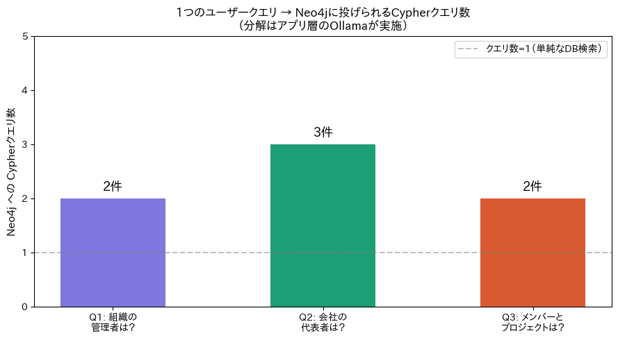

# 🔗 Graph RAG Demo — Neo4j + Ollama

[](https://colab.research.google.com/github/yourname/graph-rag-demo/blob/main/graph_rag_neo4j_ollama_v2.ipynb)
[](https://www.python.org/)
[](https://neo4j.com/)
[](https://ollama.com/)
[](LICENSE)

> **1つのユーザークエリが、なぜグラフDBへの複数クエリに展開されるのか** を、完全ローカル環境（Neo4j + Ollama）でインタラクティブに確認するデモノートブックです。

---

## 📊 デモ結果

質問の複雑さ（ホップ数）に応じて、Neo4j へ投げられる Cypher クエリ数が増加します。クエリの分解はすべてアプリ層（Ollama）が担い、Neo4j は受け取ったクエリを1件ずつ実行するだけです。



---

## 📚 目次

1. [グラフDBとは](#グラフdbとは)
2. [グラフDBの歴史](#グラフdbの歴史)
3. [Graph RAG とは](#graph-rag-とは)
4. [なぜ複数クエリになるのか](#なぜ複数クエリになるのか)
5. [デモの構成](#デモの構成)
6. [クイックスタート](#クイックスタート)
7. [ノートブックの構成](#ノートブックの構成)

---

## グラフDBとは

**グラフデータベース（Graph Database）** は、データを **ノード（節点）** と **エッジ（辺）** で表現するデータベースです。RDBのような表形式ではなく、「もの」と「もの同士のつながり」をそのまま保存・検索できます。

```
（田中太郎）──[BELONGS_TO]──▶（開発部）──[PART_OF]──▶（株式会社ABC）
                                   ◀──[MANAGES]──（山田次郎）──[REPRESENTS]──▶（株式会社ABC）
```

### RDB との違い

| 観点 | リレーショナルDB | グラフDB |
|---|---|---|
| データモデル | テーブル・行・列 | ノード・エッジ・プロパティ |
| 関係の表現 | JOIN（結合） | エッジをたどるトラバーサル |
| 多段結合の性能 | ホップ数に比例して急激に低下 | ホップ数に依存しにくい |
| 向いているデータ | 構造が均一な大量データ | 関係が複雑・多様なデータ |
| クエリ言語 | SQL | Cypher（Neo4j）、Gremlin など |

### 得意な用途

- **ソーシャルグラフ**：友人関係、フォロワー、影響力の分析
- **サプライチェーン**：部品の依存関係、製造元のトレーサビリティ
- **不正検知**：取引ネットワーク内の異常パターン発見
- **レコメンデーション**：「この人が買ったものを買った人は…」
- **ナレッジグラフ**：企業・人物・概念の関係データベース
- **Graph RAG**：LLM と組み合わせた知識ベース構築（本デモ）

---

## グラフDBの歴史

### 1960年代 — 起源：ネットワーク型DB

グラフDBの概念的な祖先は、1960年代のネットワーク型データベースです。IBMの **IMS（Information Management System）** や CODASYL モデルがレコード間のポインタによる関係表現を採用しており、現代のグラフDBの原型といえます。ただし当時は柔軟性に乏しく、スキーマ変更が困難でした。

### 1970〜80年代 — RDB の台頭と「関係」の後退

Edgar F. Codd が1970年に提唱したリレーショナルモデルが主流となり、ネットワーク型DBは衰退します。SQLによる問い合わせの簡便さと汎用性がその理由でした。しかし「JOIN を多段に重ねると性能が劣化する」という課題は、RDB が普及するにつれて顕在化していきます。

### 1990年代 — セマンティックウェブと RDF

Web の普及とともに、情報の「意味」を機械が理解できる形で表現する動きが始まります。W3C が推進した **RDF（Resource Description Framework）** は、主語・述語・目的語の三つ組（トリプル）で知識を表現するモデルで、グラフ的な発想の復権を告げるものでした。OWL や SPARQL もこの流れの中で生まれています。

### 2000年代 — Neo4j の誕生と「グラフDB」の確立

2000年、スウェーデンの Emil Eifrem らが **Neo4j** の開発を開始し、2007年に最初の公開リリースを行います。これが現代的なグラフデータベースの事実上の出発点です。同時期にはソーシャルネットワーク（Facebook, Twitter）の急成長により「関係データ」の重要性が再認識され、グラフDBへの注目が高まりました。

### 2010年代 — クエリ言語の標準化と普及

Neo4j が **Cypher** クエリ言語を開発・公開し、グラフDB の操作が格段に直感的になりました。一方、Apache TinkerPop プロジェクトが **Gremlin** をグラフトラバーサルの共通言語として提案し、Amazon Neptune、Azure Cosmos DB など大手クラウドベンダーもグラフDB機能を提供し始めます。また **知識グラフ（Knowledge Graph）** という概念が Google によって広められ、エンタープライズ分野でも採用が進みます。

### 2019年 — ISO によるグラフクエリ言語標準化へ

ISO/IEC が SQL と並ぶグラフクエリ言語の標準として **GQL（Graph Query Language）** の策定を開始。2024年に正式標準として承認されました。Cypher の構文が GQL に大きく影響を与えており、Neo4j の Cypher は事実上の業界標準として機能しています。

### 2020年代 — LLM との融合：Graph RAG へ

大規模言語モデル（LLM）の台頭により、グラフDBは新たな役割を担います。LLM は学習データに含まれない最新情報や社内固有の知識を持てないという限界を、グラフDBに蓄積した構造化知識で補う **Graph RAG** が注目を集めています。Microsoft Research の論文（2024）がこのアプローチを体系化し、エンタープライズ向け AI システムの標準構成の1つとなりつつあります。

---

## Graph RAG とは

**RAG（Retrieval-Augmented Generation）** は、LLM が回答を生成する前に外部データソースから関連情報を検索し、その内容を文脈として与える手法です。

通常の RAG がベクトルDBを使うのに対し、**Graph RAG** はグラフDBを検索ソースとして使います。これにより、単なる類似度検索では拾えない「関係の連鎖」を活用した回答が可能になります。

### 通常の RAG vs Graph RAG

| 観点 | 通常の RAG（ベクトルDB） | Graph RAG |
|---|---|---|
| 検索の単位 | 文書チャンク（意味的類似度） | ノード・エッジ（関係の連鎖） |
| 多段推論 | 苦手 | 得意（ホップをたどる） |
| 関係の明示性 | 暗黙的（埋め込みベクトル） | 明示的（エッジのラベル） |
| 更新のしやすさ | チャンク再埋め込みが必要 | ノード・エッジの追加のみ |
| 向いている質問 | 「〜について教えて」 | 「AとBはどう繋がっているか」 |

### Graph RAG の処理フロー

```
ユーザークエリ
      │
      ▼
┌─────────────────┐
│  LLM クエリ      │  ← アプリ層
│  プランナー      │     ユーザークエリを複数の
│  (Ollama)       │     Cypherクエリに分解
└────────┬────────┘
         │ 複数のCypherクエリ
    ┌────┴────┬─────────┐
    ▼         ▼         ▼
 クエリ①   クエリ②   クエリ③   ← Neo4j（DB層）
 所属組織   管理者    代表者      各クエリを個別に実行
 を取得     を取得    を取得
    └────┬────┴─────────┘
         │ 複数の結果
         ▼
┌─────────────────┐
│  LLM 結果統合    │  ← アプリ層
│  (Ollama)       │     複数結果をマージして
└────────┬────────┘     最終回答を生成
         │
         ▼
      最終回答
```

### ポイント：複数クエリはDBの内部処理ではない

> グラフDBへの複数クエリへの分解は、**グラフDBの外側（アプリ層）** で LLM が行う処理です。  
> Neo4j は受け取ったクエリを1件ずつ実行するだけであり、「これらが1つの質問から来た」とは知りません。

---

## なぜ複数クエリになるのか

自然言語の質問には、複数の「ホップ（関係の連鎖）」が含まれることがあります。

**例：「田中太郎が所属する組織が属する会社の代表者は？」**

この1文には3つの独立したグラフトラバーサルが含まれます。

```
クエリ① MATCH (p:Person {name:'田中太郎'})-[:BELONGS_TO]->(o:Org)
         RETURN o.name AS org
         → 結果: 開発部

クエリ② MATCH (o:Org {name:'開発部'})-[:PART_OF]->(c:Company)
         RETURN c.name AS company
         → 結果: 株式会社ABC

クエリ③ MATCH (p:Person)-[:REPRESENTS]->(c:Company {name:'株式会社ABC'})
         RETURN p.name AS representative
         → 結果: 山田次郎
```

LLM はこれらを順番に計画・実行し、最終的に「田中太郎の所属組織が属する会社の代表者は山田次郎さんです」と統合して回答します。

---

## デモの構成

```
graph-rag-demo/
├── graph_rag_neo4j_ollama_v2.ipynb   # メインノートブック
├── README.md                          # このファイル
└── download-4.png                     # デモ結果グラフ
```

### 技術スタック

| コンポーネント | 技術 | 役割 |
|---|---|---|
| グラフDB | Neo4j Community 5.18 | Cypherクエリの実行 |
| LLM | Ollama + llama3 / phi3 | クエリ分解・回答生成 |
| グラフDBドライバ | neo4j-driver (Python) | Bolt プロトコルで接続 |
| 可視化 | NetworkX + Matplotlib | グラフ構造の描画 |
| 実行環境 | Google Colab | すべてクラウド上で完結 |

---

## クイックスタート

### 必要なもの

- Google アカウント（Colab 利用）
- GPU ランタイム推奨（llama3 の推論速度向上のため）
- 約 10〜15 分（Neo4j インストール + モデルダウンロード込み）

### 手順

1. 上部の **Open in Colab** バッジをクリック
2. ランタイム → ランタイムのタイプを変更 → **T4 GPU** を選択
3. セルを上から順番に実行（`Shift + Enter`）

### モデルの選択

```python
# STEP 2 のセルで変更可能
MODEL_NAME = "llama3"   # 高精度（約 4.7GB）
# MODEL_NAME = "phi3"   # 軽量版（約 2.3GB）
```

---

## ノートブックの構成

| STEP | 内容 | 所要時間 |
|---|---|---|
| 1 | Neo4j インストール・起動 | 約3分 |
| 2 | Ollama + LLM モデルのダウンロード | 約5〜10分 |
| 3 | Python ライブラリのインストール | 約1分 |
| 4 | 日本語フォント設定 | 数秒 |
| 5 | Neo4j 接続・サンプルデータ投入 | 数秒 |
| 6 | グラフの可視化 | 数秒 |
| 7 | Ollama クライアント・クエリプランナー定義 | 数秒 |
| 8 | Graph RAG パイプライン定義 | 数秒 |
| 9 | デモ①：2ホップの質問 | 約1分 |
| 10 | デモ②：3ホップの質問 | 約1分 |
| 11 | デモ③：広範囲の質問 | 約1分 |
| 12 | 結果の比較グラフ | 数秒 |
| 13 | Neo4j への直接クエリ確認 | 数秒 |

---

## 注意事項

- Colab のセッションが切れると Neo4j・Ollama ともにリセットされます。再実行時は STEP 1 から順に実行してください
- Neo4j の設定セル（STEP 1）は**1セッション内で2回実行しないでください**（設定の重複エラーが発生します）
- 無料の Colab は RAM 約 12GB のため、llama3 と Neo4j の同時起動でメモリが逼迫することがあります。その場合は `phi3` モデルを使用してください

---

## 参考文献

- [Neo4j 公式ドキュメント](https://neo4j.com/docs/)
- [Ollama 公式サイト](https://ollama.com/)
- [From Local to Global: A Graph RAG Approach — Microsoft Research (2024)](https://arxiv.org/abs/2404.16130)
- [GQL Standard — ISO/IEC 39075:2024](https://www.iso.org/standard/76120.html)

---

## ライセンス

MIT License
