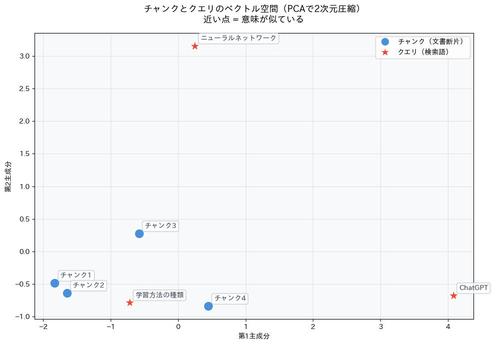
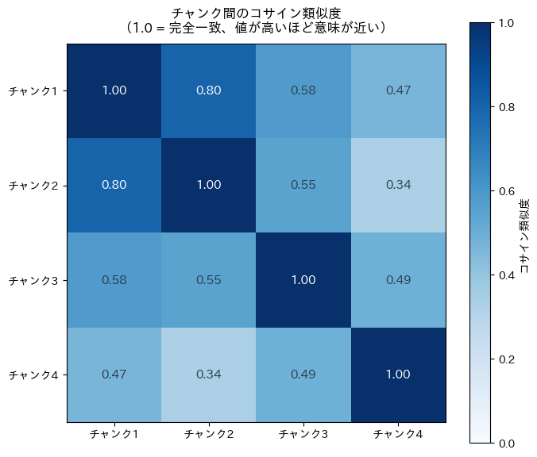

# チャンク化とベクトル化

RAGシステムの基礎となる **チャンク化**と**ベクトル化**の関係を、実際に動かして理解するためのデモノートブックです。

## 概要

大規模言語モデル（LLM）を使ったRAG（Retrieval-Augmented Generation）では、文書を検索可能な形に変換するパイプラインが必要です。このノートブックでは、そのパイプラインの中心にある2つの処理を体験できます。

```
文書全体
  ↓  【チャンク化】テキストを意味のある塊に分割
テキストの断片①②③...
  ↓  【ベクトル化】意味を数値（高次元ベクトル）に変換
数値ベクトル①②③...
  ↓
ベクトルDBに保存 → クエリと類似度計算 → 関連チャンクを検索
```

## 内容

| ステップ | 内容 |
|---|---|
| 1 | サンプル文書の準備（機械学習についての日本語テキスト） |
| 2 | チャンク化（段落分割 vs 固定長分割の比較） |
| 3 | ベクトル化（多言語Embeddingモデルで384次元に変換） |
| 4 | 類似度検索（コサイン類似度でクエリに近いチャンクを取得） |
| 5 | ベクトル空間の可視化（PCAで2次元圧縮） |
| 6 | チャンク間の類似度ヒートマップ |

## 可視化結果の見方

### ベクトル空間（PCA 2次元圧縮）



高次元ベクトル（384次元）をPCA（主成分分析）で2次元に圧縮したものです。

**PCAとは？**
PCAは「データのばらつきが最も大きい方向」を順番に見つけて、それを新しい軸（主成分）とする次元削減手法です。384次元のベクトルをそのまま目で見ることはできませんが、PCAで2次元に落とすことで「意味的な近さ」をおおまかに確認できます。

**グラフの読み方**
- 青丸（●）= 各チャンク（文書の断片）
- 赤星（★）= 検索クエリ
- **点が近いほど意味が似ている**

上の図では、「ニューラルネットワーク」クエリ（赤★）がチャンク3（ディープラーニングについての段落）の近くに配置されており、「学習方法の種類」クエリはチャンク1・2（機械学習の概要・学習方法の段落）の近くに位置しています。一方「ChatGPT」クエリは他の点から離れており、チャンク4（自然言語処理）に対応する方向に伸びています。

> **注意** PCAによる2次元圧縮は情報を一部失います。実際の類似度判定はすべての次元（384次元）のベクトル同士のコサイン類似度で行われるため、2次元図での近さと完全には一致しない場合があります。

---

### チャンク間のコサイン類似度ヒートマップ



全チャンク同士のコサイン類似度を行列形式で表示したものです。値が1.0に近いほど意味が似ており、0に近いほど意味が異なります。

**コサイン類似度とは？**
2つのベクトルがなす角のコサイン値で類似度を測る指標です。ベクトルの向きが同じであれば1.0、直交していれば0.0になります。テキストの長さに影響されず、意味的な方向性だけを比較できるため、文書検索に広く使われています。

**結果の読み方**
- 対角線（左上→右下）はすべて1.00（自分自身との比較）
- チャンク1（機械学習の概要）とチャンク2（学習手法の種類）は **0.80** と高い類似度 → どちらも「機械学習」を中心的に扱っているため
- チャンク4（自然言語処理）は他のチャンクとの類似度が低め（0.34〜0.49）→ 扱っているトピックがより特化しているため

## 環境

- Python 3.10+
- Google Colab（無料プラン・CPU可）

## 使い方

1. Google Colab を開く（[colab.research.google.com](https://colab.research.google.com)）
2. `chunking_and_vectorization_demo.ipynb` をアップロード
3. 「ランタイム」→「すべてを実行」

外部APIキーは不要です。

## 主な使用ライブラリ

| ライブラリ | 用途 |
|---|---|
| `sentence-transformers` | テキストのEmbedding（ベクトル化） |
| `scikit-learn` | コサイン類似度の計算、PCAによる次元削減 |
| `matplotlib` + `japanize-matplotlib` | グラフ描画（日本語対応） |

## 参考

- チャンク化の戦略についての詳細: [LangChain Text Splitters](https://python.langchain.com/docs/concepts/text_splitters/)
- Embeddingモデル: [sentence-transformers/paraphrase-multilingual-MiniLM-L12-v2](https://huggingface.co/sentence-transformers/paraphrase-multilingual-MiniLM-L12-v2)
