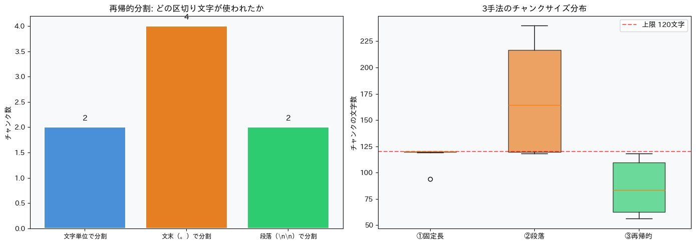
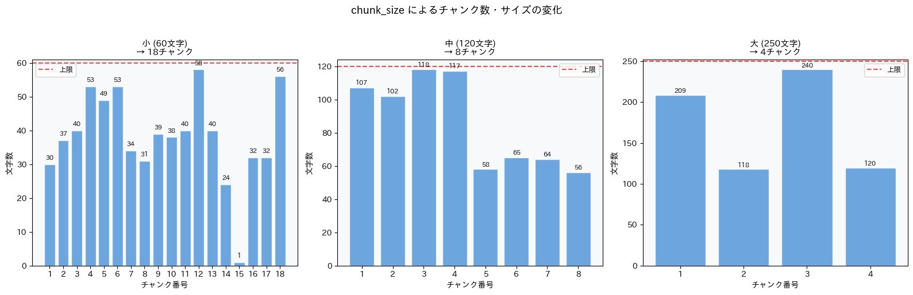
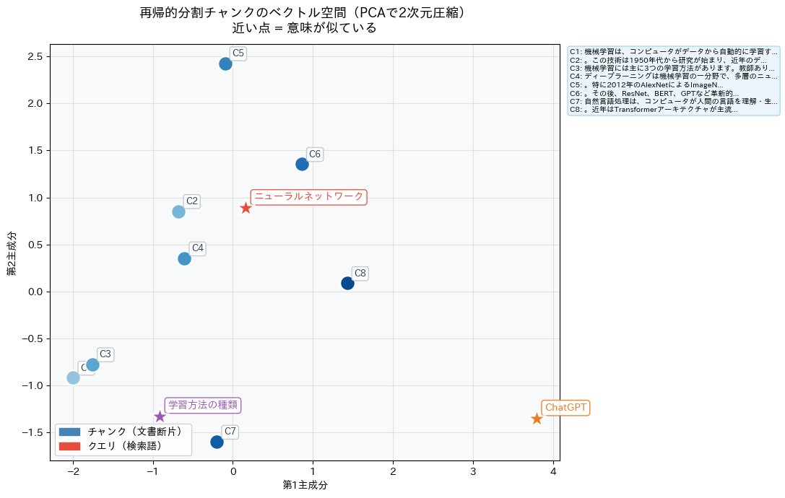

# 再帰的分割（Recursive Character Splitting）デモ

RAGシステムで最もよく使われるチャンク化手法、**再帰的分割**の仕組みを実際に動かして理解するためのデモノートブックです。

---

## 目次

1. [再帰的分割とは](#再帰的分割とは)
2. [アルゴリズムの詳細](#アルゴリズムの詳細)
3. [3つの手法の比較](#3つの手法の比較)
4. [可視化結果の見方](#可視化結果の見方)
5. [使い方](#使い方)
6. [環境・ライブラリ](#環境ライブラリ)

---

## 再帰的分割とは

長い文書を検索可能な塊（チャンク）に分割する方法のひとつです。  
「段落で切る」「文字数で切る」という単純な方法の**いいとこ取り**をしたアプローチで、LangChainの `RecursiveCharacterTextSplitter` として広く使われています。

### 他の手法との比較

| 手法 | 仕組み | メリット | デメリット |
|------|--------|----------|------------|
| 固定長分割 | 一定文字数ごとに機械的に切る | シンプル・高速 | 文の途中で切れる |
| 段落分割 | 空行（`\n\n`）で切る | 意味のまとまりを保つ | サイズがバラバラになる |
| **再帰的分割** | 優先順位に従い階層的に切る | サイズを保ちながら意味も考慮 | パラメータ調整が必要 |

---

## アルゴリズムの詳細

再帰的分割の核心は「**区切り文字の優先順位リスト**」です。  
チャンクが目標サイズに収まるまで、優先度の高い区切り文字から順に試みます。

### 区切り文字の優先順位（日本語の場合）

```
1位: \n\n  （段落の区切り）  ← まずここで切ろうとする
2位: 。    （文末）
3位: 、    （読点）
4位: " "   （スペース）
5位: ""    （文字単位）      ← 最終手段
```

### 処理フロー

```
文書全体を受け取る
      │
      ▼
 ┌─────────────────────────────────────┐
 │  優先度1位（\n\n）で分割してみる     │
 └─────────────────────────────────────┘
      │
      ├─ チャンクが chunk_size 以下 → ✅ そのまま確定
      │
      └─ チャンクが chunk_size を超える → まだ大きい
                │
                ▼
         ┌─────────────────────────────────────┐
         │  優先度2位（。）で分割してみる       │
         └─────────────────────────────────────┘
                │
                ├─ chunk_size 以下 → ✅ 確定
                │
                └─ まだ大きい → 次の区切り文字へ...
                          │
                          ▼
                   優先度3位（、）で試みる
                          │
                         ...
                          │
                          ▼
                   最終手段: 文字単位で切る
```

### 具体例

```
入力テキスト（200文字の段落）:
「機械学習は、コンピュータがデータから自動的に学習する技術です。従来の
プログラミングでは...（省略）...現在ではほぼすべての産業分野で活用されて
います。」

chunk_size = 120 の場合:

Step1: \n\n で分割 → 1塊 200文字 → ❌ 超過
Step2: 。 で分割  → 複数の文に分かれる
         └─ 「機械学習は...技術です。」   60文字 → ✅ 確定
         └─ 「従来の...ありました。」     55文字 → ✅ 確定
         └─ 「しかし...発見します。」    115文字 → ✅ 確定
         └─ 「...活用されています。」     50文字 → ✅ 確定
```

### オーバーラップ（chunk_overlap）

チャンクとチャンクの境界付近では、どちらのチャンクにも含まれない情報が生まれやすくなります。  
`chunk_overlap` を設定することで、**前のチャンクの末尾を次のチャンクの先頭に重複させ**、文脈の途切れを緩和します。

```
chunk_overlap = 0 の場合:
  チャンク1: [... Aという概念は重要で]
  チャンク2: [、その応用として...]   ← 「Aという概念」が消える

chunk_overlap = 30 の場合:
  チャンク1: [... Aという概念は重要で]
  チャンク2: [概念は重要で、その応用として...]  ← 文脈が引き継がれる
```

---

## 3つの手法の比較

### 区切り文字の使われ方とチャンクサイズの分布



**左グラフ（区切り文字の内訳）**  
`chunk_size=120` で再帰的分割を行ったとき、実際にどの区切り文字が使われたかを示しています。文末（`。`）での分割が最も多く4チャンク、次いで段落（`\n\n`）と文字単位がそれぞれ2チャンクでした。段落で切ると120文字を超えるケースが多く、文末まで掘り下げて分割されていることを意味します。

**右グラフ（チャンクサイズの箱ひげ図）**  
3手法のチャンクサイズのばらつきを比較しています。

- **①固定長**: サイズが赤い上限線（120文字）付近に揃う。ただし意味の途中で切れる
- **②段落**: サイズが大きくバラバラ。上限の120文字を大幅に超えるチャンクが生まれている
- **③再帰的**: すべてのチャンクが上限以内に収まり、かつばらつきも適度に小さい

---

### chunk_size による挙動の変化



`chunk_size` を小・中・大で変えたときのチャンク数とサイズの変化です。  
赤い点線が `chunk_size` の上限を示しており、再帰的分割ではすべてのチャンクがその範囲内に収まっています。

| chunk_size | チャンク数 | 特徴 |
|-----------|-----------|------|
| 小（60文字）  | 18チャンク | 細かく分割。1チャンクの情報量が少ない。精密な検索に向く |
| 中（120文字） | 8チャンク  | バランスが良い。実用的なRAGでよく使われる範囲 |
| 大（250文字） | 4チャンク  | 1チャンクに多くの文脈を含む。検索のノイズが増えやすい |

**RAGにおけるトレードオフ**:  
`chunk_size` が小さいほど検索の的中精度（Precision）は上がりやすいですが、チャンクに含まれる文脈量が減ります。逆に大きいほど文脈は豊富になりますが、クエリと無関係な情報が混入しやすくなります。

---

## 可視化結果の見方

### ベクトル空間（PCA 2次元圧縮）



再帰的分割で生成した8チャンク（C1〜C8）と3つのクエリをベクトル化し、PCAで2次元に圧縮した図です。

**PCA（主成分分析）とは？**  
Embeddingモデルが出力する384次元のベクトルはそのまま目で見ることができません。PCAは「データのばらつきが最も大きい方向」を新しい軸（主成分）として選び、情報をなるべく保ちながら低次元に圧縮する手法です。2次元に落とすことで、チャンク同士の意味的な遠近関係を視覚的に確認できます。

**グラフの読み方**

- 青丸（●）C1〜C8 = 各チャンク。右上の凡例にチャンクの先頭テキストを表示
- 赤★「ニューラルネットワーク」→ C5（AlexNet関連）・C6（ResNet, BERT, GPT関連）の近くに位置
- 橙★「ChatGPT」→ 他の点から大きく離れた右下に位置。C8（Transformer・自然言語処理）に対応する方向
- 紫★「学習方法の種類」→ C1〜C3（機械学習の概要・学習手法）が集まる左下エリアの近くに位置

再帰的分割により文の途中で切れることなく意味のまとまりが保たれているため、関連するチャンク同士が空間上でも近くに集まっています。

> **注意**: PCAによる2次元圧縮は情報を一部失います。実際の検索では全384次元のコサイン類似度を使うため、2次元図での近さと完全には一致しない場合があります。

---

## 使い方

1. Google Colab を開く（[colab.research.google.com](https://colab.research.google.com)）
2. `recursive_splitting_demo.ipynb` をアップロード
3. 「ランタイム」→「すべてを実行」

外部APIキーは不要です。CPU環境（無料プラン）で動作します。

---

## 環境・ライブラリ

- Python 3.10+
- Google Colab（無料プラン・CPU可）

| ライブラリ | 用途 |
|---|---|
| `langchain-text-splitters` | RecursiveCharacterTextSplitter |
| `sentence-transformers` | テキストのEmbedding（ベクトル化） |
| `scikit-learn` | コサイン類似度・PCAによる次元削減 |
| `matplotlib` + `japanize-matplotlib` | グラフ描画（日本語対応） |

---

## 参考

- [LangChain Text Splitters ドキュメント](https://python.langchain.com/docs/concepts/text_splitters/)
- [RecursiveCharacterTextSplitter API リファレンス](https://api.python.langchain.com/en/latest/character/langchain_text_splitters.character.RecursiveCharacterTextSplitter.html)
- Embeddingモデル: [paraphrase-multilingual-MiniLM-L12-v2](https://huggingface.co/sentence-transformers/paraphrase-multilingual-MiniLM-L12-v2)
